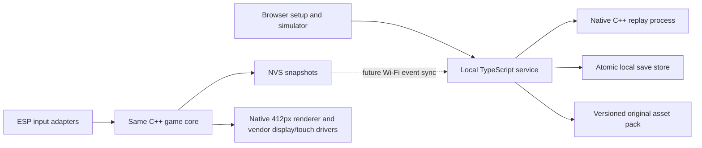

# Digivice: first playable slice

Decision record begun 4 October 2026. Current exported source uses **care schema21/rules14, 2,952-byte snapshots, 60 carried Digimon and service container16**; practice remains schema/rules7 with store8. See [current collection/migration limits](ROSTER60.md). Source and compiler evidence do not establish physical acceptance; earlier installation references below are historical.

The user is building **two physical Digivices**; each retains its own identity, companion save and offline operation. The later authorized Nearby source adds explicit-consent ESP-NOW friendly duels with isolated state and no progression rewards. Portable protocol verification does not establish physical RF acceptance. [Nearby protocol](NEARBY_PROTOCOL.md).

## Product and authority

The handheld is a standalone companion. Care, steps, encounters, battles, card buffs, capture, XP and Digivolution run locally. No phone, AI call, or live server response belongs in a battle loop. Missing care never kills a creature; this ruleset has no elapsed-time punishment. Bundled creature art is original. The catalog retains 465 stable form IDs; 455 production forms are eligible for new encounters. Original test forms remain available only through explicit development fixtures. Aliases and visual variants remain separate source identities; this is not a deduplicated canonical species count. Eight fixed egg starters retain two curated routes through Champion, Ultimate and Mega; three additional reviewed Rookie offers are saved once per unhatched identity, giving eleven choices. The wider graph contains reviewed progressions and explicit terminal/independent dispositions; unavailable character art uses truthful placeholders. Official names/stages do not make our paths, gates, stats or game types official.

The service owns the published catalog, accepted save revision and progression validation. The device owns immediate play and snapshots. Native pairing/save-sync and a durable pending event journal remain unimplemented; Wi-Fi setup does not establish that transport. Both execute the same C++ rules, including deterministic integer combat and seeded capture randomness. This provides server validation while keeping travel and phone-off play usable. No live network or AI response is required during a battle. Browser gameplay currently uses its loopback service.

Offline play cannot prove that steps came from a sensor or that an NFC UID was genuine. Event replay proves legal rule transitions, not real-world activity. Do not use these prototype saves for ranked competition, purchases, scarce tradable rewards or anti-cheat claims. Signed content and device attestation would be separate later decisions.

## Small modules

| Module | Responsibility | Current boundary |
|---|---|---|
| `core/` | Bounded state, pure transitions, deterministic RNG, versioned CRC snapshot | Built and exercised on host; compiled into ESP project source |
| `service/` | Local pairing, catalog/download, save receipts, replay validation | One process and a bounded filesystem store; development only |
| `web/` | Round-screen preview, asset rendering, simulated sensors, save UI | Calls local service; the browser itself is not an offline firmware emulator |
| `firmware/` | ESP-IDF main loop, serial/touch events, NVS restore/save, capabilities | Native 412×412 UI, bounded motion/usage, screen/backlight idle and Nearby; physical qualification remains separately tracked |
| `assets/` | Original pixel frames and metadata | Browser packs and bounded DVA/JPEG microSD cache; installed baseline has verified hashes/decodes, human-visible artwork acceptance remains open |

The native replay subprocess is deliberately easy to audit at this scale. A 10,000-event ceiling bounds each device history. Before longer-lived releases, add acknowledged checkpoint compaction so reconnect cost stays bounded without losing retry receipts. No queues, distributed workers, Redis, Kubernetes or cloud accounts are needed for this slice.

The browser now presents the round-screen menu through a pure navigation model and a DOM renderer above the sprite canvas. Navigation only selects screens; game commands still pass through the existing durable save client. Left tap selects Next, left hold goes Back, and right tap confirms; hold release and repeated keys cannot issue a second action. This is a tested browser input contract, not verified GPIO wiring.

Skill-counter PvE practice is a separate portable C++ state machine and CLI. It freezes the selected companion's identity, form and level, but cannot write to the care/capture event stream or award XP. Its bounded mirrored store and exact retry receipts share the service's exclusive writer lock. Wild encounters and new practice duels call the form/stat/type resolver in `core/combat.cpp`. New practice uses schema/rules 7, store 8, 120-byte snapshots and a 40-exchange limit. Older practice epochs 2–4 retain 30 exchanges; epoch 5 retains 40 exchanges and its fixed raw minimum of 4; epoch 6 retains its original HP-scaled floor, profiles and phase-only Auto. Care uses schema 20/rules 13; practice remains separate. Older practice duels retain their stored epoch, including version-2 112-byte snapshots. New practice rivals are independently selected from eligible forms at the partner's level; wild rivals also freeze the current level at encounter start and alternate physical/magic retaliation. Enemy commitment/RNG stay private. Firmware uses the same practice engine through a serial session and separate NVS records with one retained exact-command receipt; display integration remains open. [Device practice boundary](ESP_PRACTICE.md) · [Gameplay review](GAMEPLAY_REVIEW.md).

Practice rules 6 pass `max(4, ceil(intended defender maxHP / 20))` into the shared resolver as its raw damage minimum, before type, guard and reflection adjustments. The intended defender sets this value even if Counter reflects the attack. The 40-exchange budget allows 20 attack slots per side; scaling the minimum repairs the demonstrated high-HP mirror draw trap without changing stats or forcing a winner. Wild combat and saved practice epochs 2–5 keep a raw minimum of 4; practice epoch 6 retains the HP-scaled minimum.

Both kinds of battle support Tactical and strict Auto. Wild mode is saved at Home and locked for an encounter; practice mode is fixed by its start request. Auto requires explicit confirmation, resolves through a bounded native operation, and is committed before browser playback. Wild uses ordinary combat/capture consequences with one outer event; practice remains reward-free and separate from care. Snapshots predating mode selection and mode-less practice requests default to Tactical; an existing saved Auto choice survives migration. Public traces contain resolved turns, not private seeds or unrevealed intent. [Mode, replay and future mutual-duel agreement contracts](BATTLE_MODES.md).

Each collection member has independent lineage, form, XP, level, bond and care. Wild wins/captures award `20 + 6 × wild level` XP to the active partner; neither care nor practice grants XP. Level `L` starts at `20 × (L−1) × L` total XP, capped at level 20 / 7,600 XP. Bond remains separate. The original 276 form IDs and numeric curves stay fixed, including the original 66; the 210 earlier additions use 28 reviewed stage/role curves. Dawn/Dusk sheet additions through form 465 use those same stage and role budgets with zero species variation. Catalog 4 adds a separate overlay of 30 reviewed combat-name bindings across 26 forms, with 24 actual renames. Unbound slots retain authored labels. Category assignments and effects remain the prototype's Physical/Heavy/Magic mechanics, not official damage-class claims or bespoke species effects; historical replay keeps its old labels.

Evolution is a separate acyclic table of **263 edges**, preserving all 172 previous choices/gates and adding 91 Dawn/Dusk sheet routes, independent of stable profile-family IDs and stat anchors. The earlier additions are authored alternatives backed by the pinned DigiGame forward table, not canonical requirements. The sheet routes use the existing Champion, Ultimate, Mega, and Armor level and bond gates. A form can have multiple incoming routes and at most two outgoing choices. A cross-family evolution adopts the target form's profile family while retaining the individual member. Early-stage routes use level 1/bond 10 into In-Training and level 1/bond 20 into Rookie; usual Champion/Ultimate/Mega gates are level 5/10/15 and bond 20/50/80. Exact gates belong to each edge. There is no automatic evolution. A Home-only confirmation keeps the same member, XP and history and preserves the HP fraction; active or uncertain practice blocks it. The 41 remaining lower-stage leaves include intentional variants and independent forms, absent destinations/intermediates, and deferred identity/fusion/mode cases. [Route decisions and taxonomy](research/digigame-gameplay-evolutions.json) · [Native form contract](../core/forms.hpp).

Rules-12 care derives up to +5 Attack/Magic and +5 Defense/Resistance from existing bond, mood and fullness; base HP, XP and form curves stay unchanged. Full-mood Play cannot farm energy or bond. Nearby freezes these bonuses into the agreed matchup; practice retains its separate rules. Current traces identify combat rules 12 and include the two care bonuses and resolved capture results. Older traces keep their historical representation. [Exact care contract](CARE_CAPTURE_RULES12.md).

For new rules-12 wild encounters, an aimed capture at half HP or below starts with `50 + floor(40 × (wildMaxHp − 2 × wildHp) / wildMaxHp)`, subtracts rarity penalties of 0/10/20 and up to 25 points for a higher-level target, then clamps to 10–90%. Ordinary wild targets currently match the partner’s level. An aim miss records zero chance; aimed throws use one RNG roll. Each committed throw saves its result before playback; exact odds appear after the throw. Misses and escapes cause no retaliation, and a third failed throw ends the encounter gently. Collection-capacity checks still apply. Existing encounters dispatch their stored rules, including historical capture odds and retaliation. [Capture contract](CARE_CAPTURE_RULES12.md#three-capture-throws).

## Contracts

`rulesVersion` identifies transition semantics. `schemaVersion` identifies saved state format. They are separate from the asset pack version. Never silently replay an old save under changed rules. Keep an explicit migration or retain the earlier rules executor.

The [current world-seed contract](CAPTURE_RING_WORLD_SEED.md) adds trusted one-time `world-seed` setup without changing capture or pacing RNG. Service initialization uses authenticated `POST /api/world/seed`; native firmware commits startup entropy locally.

An eligible walking input is `{ "type": "explore", "value": 20 }`. Supported actions include: `feed`, `play`, `rest`, `recover`, `walk`, `explore`, `encounter-rate`, `encounter-seed`, `card`, `attack` (normal physical), `heavy`, `magic`, `capture`, `flick`, `select`, `release`, `starter-offer-seed`, `hatch`, `mode`, `auto`, `evolve`. An unseeded egg accepts one nonzero uint32 `starter-offer-seed`; the resulting three offers must checkpoint before display. Hatching accepts fixed slots 1–8 or saved offer slots 9–11 only while unhatched. The authenticated service `POST /api/starter-offers` uses independent cryptographic entropy and a durable event/receipt; retries return the saved offers, and unresolved old pending batches block initialization. Selection uses a stable, monotonically allocated member ID and is allowed at Home; eight is the carried-member limit, not the ID range. Release removes only an inactive member and keeps its journal credit. `evolve` carries a form ID in 1–276 connected by an eligible explicit outgoing edge; clients cannot supply replacement stats or XP. Mode accepts 0 for Tactical or 1 for Auto at Home; `auto` uses zero and resolves an Auto encounter. Nonparameter actions use zero; walk is bounded per event; card IDs 1 and 2 represent a boost and shield. Hardware drivers map sensor/module output into these validated events and never mutate state directly. The core rejects invalid actions transactionally. Identical seed and event order produce identical state.

Current physical walking uses `explore` with 1–1,000 eligible steps, Home-only `encounter-rate` values 0–3, and one nonzero `encounter-seed` before initialization. Legacy `walk` remains a frozen rules-10 harness input. Saved pacing and capture RNG are separate. Physical lifetime usage is a separate `digi_usage` store, starts at zero rather than importing old simulated totals, and batches dirty writes at 64 steps or 30 seconds. Abrupt loss can discard the unflushed tail. [Migration and durability](WALKING_NEARBY_RELEASE.md#save-migration-and-durability).

The API accepts events instead of trusting a client-supplied final creature. A save response includes revision, canonical state and nullable `autoTrace`; current state exposes XP/form fields and at most two `evolution.options`. `GET /api/evolution-graph?formId=11&offset=0&limit=8` exposes the connected graph component in bounded read-only pages (maximum 16 nodes; browser uses eight). Browsing includes incoming links; only directed outgoing edges permit evolution. The older lineage catalog stays a stable profile-family projection rather than the cross-family graph. Practice responses include `{revision,mode,autoTrace,battle}`. A new care sync request includes `rulesVersion:13`, `baseRevision`, a unique `batchId`, and bounded ordered events. Repeating a batch with the same body returns its prior receipt; reusing its ID with different events fails. Conflicting revisions require reconciliation, never last-writer-wins rollback. See [service API](../service/API.md) for the implemented request/response shapes and limits.

The development pairing flow is a short-lived local code claimed by the virtual device. It yields a random bearer credential; only its hash belongs in the service store. It is not production ownership proof or a device transfer system. The browser token is local development storage; production pairing must use a device-displayed physical confirmation, owner authorization and TLS. Never migrate identity by copying a MAC address or accepting arbitrary device IDs. Future factory reset and ownership transfer must revoke the old credential and preserve/import only an explicitly selected save.

## Durability, sleep and failure

Apply events to a candidate state first, persist it, then acknowledge it. The service uses atomic file replacement and bounded receipts so a lost HTTP reply does not duplicate a reward. Invalid/corrupt/future-format saves must be quarantined or restored from a known-good copy; they must never trigger silent creation of a fresh pet.

The ESP starter uses explicit snapshots and CRC checks, plus NVS commits; no raw C++ object memory is used as a portable save. A CRC detects corruption, not malicious modification. Gameplay mutations checkpoint before publication; physical step polling now batches usage and exploration writes to avoid per-step flash writes. Before production, complete the device sync journal/checkpoint transaction, low-voltage tests and a tested rollback policy. A crash may lose only input that has not been acknowledged durable.

Networking should run in short sessions after a save checkpoint, on explicit sync or available Wi-Fi, with exponential backoff and jitter. Retain the current pack and pending events on failure. User actions remain local. Suspend downloads at low battery only once actual telemetry is measured; no battery percentage or charger control is assumed. Screen/backlight idle is implemented with a saved timeout; touch and motion sampling remain active, and a wake contact is consumed before normal input resumes. It is not CPU deep sleep or measured battery savings. Save before any deliberate sleep. Deep-sleep wake sources and step counting while asleep require board/sensor bench validation; keeping the IMU powered does not itself prove reliable low-power counting.

## Privacy and resources

Only steps and game actions are stored in this slice. There is no raw GPS, route, child name, birthdate or account profile field. If regional encounters are added, coarse region selection stays local by default, with explicit consent for any upload. NFC UIDs are not uploaded; drivers map recognized cards to a bounded game ID. UID matching is a toy input, not a security credential.

Asset ingestion must cap file count, byte count, frame dimensions, palette size and decompressed size; validate hashes before activation. Keep a fallback built-in creature and activate a fully validated pack atomically. The prototype serves bounded original fixture packs; it is not an arbitrary asset upload endpoint. Public deployment requires TLS, real ownership authorization, rate limiting, backups, token revocation and a reviewed firmware update path.

See [current hardware verification](PARK_HARDWARE.md), [firmware status](FIRMWARE.md), [backlog](BACKLOG.md), and [verification/budgets](VERIFICATION.md).

Current care is **schema 20/rules 13, 664-byte snapshots**, with eight bounded members and a 512-bit obtained-form journal. Canonical snapshots use explicit fields and CRC; [storage bounds](COLLECTION_RULES.md#persistence-and-history) are separate from host structure layout. Service container 15 archives historical events and receipt identities before storing a migrated baseline. Frozen rules 1–12 execute their historical transition semantics, with old form graphs, combat profiles and move labels, so a new route cannot retroactively validate an old command. Existing member IDs, profile families, forms, XP, care, RNG and receipts remain intact. Active encounters retain their stored rules, and old pending commands need explicit reconciliation. New practice uses **schema/rules 7, store 8, 120 B**, with strict frozen dispatch for epochs 2–6. These compatibility boundaries do not relabel old requests. Game JSON capacity is 12,288 bytes; a measured expanded-state sweep reached 8,212 bytes, exceeding the former 8,192-byte limit. Snapshot size is serialized storage, not runtime RAM usage.

The original asset manifest's `rulesVersion:1` is a separate unchanged art-binding epoch, not the current gameplay version. Franchise forms have null bundled `artId`; separately audited private packs can bind an exact form without changing its gameplay profile. Source-sheet download, visual review, frame mapping and runtime integration are distinct steps. Personal art is locally selected, unsigned user content, structurally checked and isolated from save state and signed original-pack distribution.

New identities begin in an explicit empty egg state. A separate `starter-offer-seed` event durably fixes the extra choices before display; migration itself never draws offers or hatches. One `hatch` event establishes founder ID 1 and completion atomically; it uses the existing save-sync revision and durable batch receipt. Existing identities retain their recorded initializer, including saves with zero events. They never enter onboarding just because their sequence is zero. Completion/starter fields introduced in schema 5 remain intact in current snapshots. [Current starter and compatibility contract](STARTER_OFFERS.md); [historical eight-starter reference](ONBOARDING.md).

The earlier rules-9 tuning milestone changed only the Original Lumen/Pelagia Ultimate anchors and practice Auto. Care migration scales affected Home/inactive HP proportionally; old active encounters use their old profiles through combat and reward resolution before one terminal conversion. Practice7 scores public profiles/HP over all three possible opponent moves with a separate seeded tie stream. It does not receive opponent commitments, future choices or Tactical’s two-option hints. Current wild Auto resolves attacks until capture becomes eligible, then pauses for a manually timed throw or explicit Resume fighting. Practice Auto continues without mid-battle input. Neither Auto path spends field cards; frozen historical Auto events retain their recorded behavior. Confirmed Recover fully batches the native count of existing Rest events through one transactional save. New wild encounters also allow explicitly confirmed release of an inactive companion without changing the opponent or combat state. [Park-session design and evidence](PARK_PLAYTEST.md).
