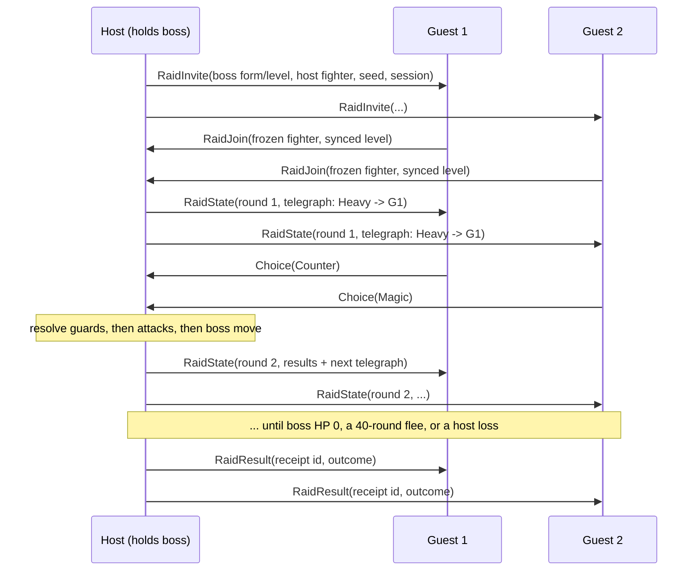

# Boss sightings and Nearby raids — design (proposed, not implemented)

Status: design for review. Nothing here is in the core yet. It builds on rules 17 ([care mistakes and injury](CARE_MISTAKES_INJURY.md)) and the existing Nearby duel transport ([protocol](NEARBY_PROTOCOL.md)).

## Why bosses exist

Today the world scales to the partner (wild level = partner ±1, tier ≤ partner tier), fights carry no stakes beyond a free Rest, and the player never chooses a guard in wild combat. Bosses add the three missing things in one feature:

1. **A destination for walking.** A boss is earned by distance, not found at random.
2. **Real stakes.** A loss is a knockout: injury plus a care mistake (rules 17), which can lock the clean Digivolution route. Care quality now matters going into a fight.
3. **Defensive play.** Bosses telegraph their next attack, so Brace/Ward/Counter — today used only by wild AI, Practice and Nearby — become player decisions in the main loop.

Raids then turn that into the reason to bring two devices to the same park.

## Decisions

| Question | Decision | Why |
| --- | --- | --- |
| Is it a menu item? | **No permanent menu.** A **BOSS** panel appears in the Home carousel only while a boss is held, and the NEARBY panel gains **HOST RAID** at the same time. | The round screen has four Home panels already; a permanently empty fifth one is noise. The panel is also the "you earned something" signal. |
| How is a boss earned? | One **boss charge** per **5,000 eligible walking steps** (first one at 2,000 after level 5). One held boss at most; extra charge stops accruing while one is held. | Same "single frozen slot, no backlog" rule as `pendingEncounter`. ~2/day for an active kid. |
| Does a held boss expire? | **Never.** | The project rule is that offline/overnight time is never punished. |
| Who is the boss? | Deterministic from `worldSeed` + boss index: a **rare- or uncommon-rarity form one combat tier above the partner** (Mega partners face Mega), at partner level **+3**, cycling grove → tide → ember type themes. | Rare forms are otherwise ~0.1% per encounter; bosses become the reliable path to them. Type theme lets players prepare a counter-type partner. |
| Solo or group? | **Both.** Solo is always available; a raid is optional and easier. | Raids must never be required, because many players have one device. |
| What happens on a loss? | Partner is knocked out (injury + 1 mistake). **The boss stays held.** | Stakes without losing the earned item. |
| What happens on a timeout? | Boss flees after 40 rounds; boss stays held, no injury. | Matches the Practice cap; stalling is not punished like losing. |
| Reward | **3× wild XP** (`3 × (20 + 6 × bossLevel)`) to partner and XP companions, +20 bond, and **one guaranteed capture throw** at base 60% (graded by the existing timing ring, three wiggles, one RNG draw). Captured bosses join as ordinary members at boss level. | The capture throw is the headline reward; XP keeps it useful once collected. |
| Raid size | **2–4 devices** (host + up to 3). | Matches `kMaxPeers = 4` discovery and fits one 240-byte state packet. |
| Who needs a boss to raid? | **Only the host.** Guests join free. | Hosting is the generous act; every guest is a potential future host. |
| Raid rewards | **Every finisher** gets the full reward on their own device, including **their own capture throw** with their own RNG. | No loot contention, no "who gets it" arguments between kids. |
| Level gaps | **Level sync**: each fighter fights at `min(own level, bossLevel + 5)`, never below its form's `minLevel`. Rewards use the player's real level. | A Lv45 Mega would otherwise trivialize a Lv12 friend's boss. |

## Boss combat (solo and raid share one resolver)

A **round** has two halves: the boss telegraphs, then every player acts at the same time.

- **Telegraph**: the boss announces `{move: Physical | Magic | Heavy, target: one player | ALL}` one round ahead. The move comes from a role-weighted table (Guardian favors Heavy, Mystic favors Magic), from a seeded RNG stream that is separate from the capture RNG.
- **Player action**: a targeted player sees the **three guard buttons** (Brace / Ward / Counter). Everyone else sees the **three attack buttons**. That stays at three contextual buttons, which fits the 412 px round layout used by Nearby.
- **Resolution order**: guards, then player attacks in slot order, then the boss attack. It uses the existing `resolveCareForms`, type chart, guard halving and Counter reflection, the 5% crit, the Practice chip floor `ceil(maxHp / 20)` for player hits, and Heavy's 6 energy.
- **Phases**: at ≤66% HP the boss telegraphs Heavy twice as often. At ≤33% it gains **ALL** target attacks on every third round, so in a raid everyone guards that round.
- **Boss HP is budgeted in hits, not multiplied.** `bossHp = H × bestHit(hostFighter → boss)`, with `H = 12` solo and `H = 12 + 9 × (n − 1)` for an n-player raid, clamped to [1×, 6×] the form's natural max HP. This keeps solo fights around 12 player actions at every level, regardless of the level-scaling damage problem in the balance review.
- **Idle players**: after 30 s without a choice, the native Auto policy chooses for that player, so one distracted kid never stalls the group.

```mermaid
stateDiagram-v2
    [*] --> Charging: 5,000 eligible steps
    Charging --> Held: charge complete (BOSS panel + HOST RAID appear)
    Held --> Solo: FIGHT SOLO
    Held --> Lobby: HOST RAID
    Lobby --> Raid: host START (1-3 guests joined)
    Lobby --> Held: cancel / everyone left
    Solo --> Victory: boss HP 0
    Raid --> Victory: boss HP 0
    Solo --> Held: knockout (injury +1 mistake) or 40-round flee
    Raid --> Held: host lost / flee / host disconnect
    Victory --> Capture: one guaranteed graded throw per finisher
    Capture --> [*]: boss consumed (host only); next charge starts
```

## Raid networking

The design reuses the duel transport's model: ESP-NOW channel 1, host-authoritative deterministic lockstep, ACK and retry every 500 ms, reconnect window 5 s, session drop at 30 s, CRC32, sender MAC checks and session nonces. Only the host advances state, one exchange at a time. Guests verify that the host's result includes their own submitted choice.

**Packet budget (240 B maximum).** RaidState = 34 B header + boss block 24 B (form, level, phase, HP, max HP, telegraph, round) + 4 × 20 B frozen fighters + 4 × 6 B combat state (HP, energy, flags) + 4 B CRC = **166 B**. RaidInvite and RaidJoin are each under 100 B.

**Dropouts.** If a guest drops, the host keeps that fighter on Auto until the end, and the dropped guest gets no reward because it never received a RaidResult. If the host drops, the raid ends for everyone. The boss is not consumed and the guests lose nothing.

## Rewards from a radio session (the hard part)

Today the whole save replays deterministically from each device's own event history, and that is exactly why Nearby duels are reward-free. A raid reward breaks that unless it is journaled the way trades are.

- The host's final **RaidResult** carries a receipt: session ID, boss form/level, participant MACs, seed, round count and outcome. Each device writes it to a small NVS **raid journal** (same pattern as the trade journal) before applying anything.
- The core gets one durable event, `raid-reward(receiptSlot)`. Replay reads the reward parameters from the journaled receipt, not from radio, and a **claim ring of the last 8 session IDs** in `State` rejects duplicates.
- The service treats `raid-reward` like trade receipts: it is accepted only with an archived receipt body, and its hash is checked.
- Like the duel protocol, this is **friendly-play trust**, not anti-cheat. A modified device can lie about a raid. The scope statement in NEARBY_PROTOCOL.md applies unchanged.

## Save cost

| Field | Bytes |
| --- | --- |
| Boss charge steps | 4 |
| Held boss `{formId, level, index}` | 12 |
| Boss victories (journal/achievements) | 4 |
| Raid claim ring (8 session IDs) | 32 |
| **Total snapshot growth** | **52** (3,216 → 3,268; schema 25) |

The raid journal lives beside the trade journal in NVS. One extra record is about 96 B, well inside the reserve noted in ROSTER60.md.

## Risks I'd push back on

1. **Physical two-board ESP-NOW has never passed acceptance** (NEARBY_PROTOCOL.md). Do not build raids until duels pass on real boards. **Ship solo bosses first**: they are pure core, need no radio, and deliver most of the value.
2. **Fix damage-vs-level scaling first or alongside.** The hit-budgeted HP above hides the problem inside boss fights, but wild fights at level 40+ will still drag. Bosses will make that contrast obvious.
3. **The browser never sends `care-minute`.** Browser players get no injury neglect and stall on care points, so bosses won't feel the same in the simulator as on the device.
4. **Simulate before tuning.** Run the existing native balance harness over every boss form × partner tier × party size. Targets: solo Tactical win rate 55–70%, 2-player raid ≥90%, mean solo length 10–14 player actions. Then lock `H`.

## Build order

| Phase | Scope | Depends on |
| --- | --- | --- |
| 1 | Boss charge, held slot, BOSS Home panel, solo boss resolver (telegraph + player guards), guaranteed throw, schema 25 | rules 17 (done) |
| 2 | Balance pass with the native harness; damage-vs-level fix | Phase 1 |
| 3 | Raid lobby + RaidState protocol on host-tested transport (portable fault-injection tests, like duels) | Physical duel acceptance |
| 4 | Raid journal, `raid-reward`, claim ring, service receipt archive | Phase 3 |

Open choices for you (real tradeoffs):

- **Guest capture throw**: full 60% base (recommended; every kid leaves with a shot) vs. a reduced 30% for guests to make hosting more valuable.
- **Boss tier**: one tier above (recommended; aspirational, hard solo) vs. same tier (friendlier for one-device players).
