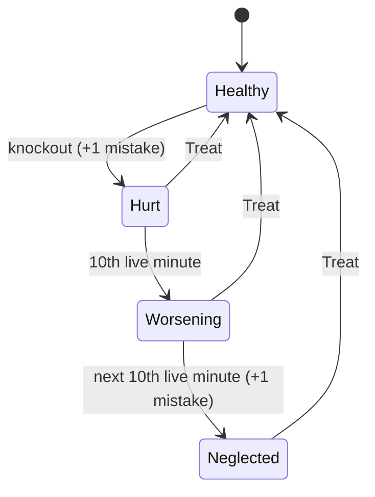

# Care mistakes, care-quality routes and injury (rules 17)

Rules 17 / schema 24 make care quality decide Digivolution routes, and make a knockout cost something. Snapshot layout is unchanged at **3,216 bytes**: the new per-member fields live in the five previously unused high bits of each member's `careState` word. Rules 16 is frozen as `core/legacy_v16.*` for exact replay of older histories.

## What the player sees

| Mechanic | Rule |
| --- | --- |
| Care mistake: toilet overflow | Toilet need reaching 100 on a live care minute counts **one** mistake per episode (the existing "missed care" moment). |
| Care mistake: hunger | Fullness dropping from 1 to 0 on a live care minute counts one mistake. Staying at 0 is not recounted. |
| Care mistake: knockout | A wild defeat in a rules-17 encounter counts one mistake and injures the partner. Explicit **Run Away** and Auto's bounded turn limit do not. |
| Care mistake: neglected injury | An injury worsens one step on each live care minute that is a multiple of **10** (hurt → worsening → neglected). Reaching *neglected* counts one more mistake, once. |
| Mistake counter | Per Digimon, 0–7 (saturating), reset by Digivolution. |
| Injury effect | Rest restores HP only to **half** maximum; Digivolution is blocked. |
| Treat | New Home action. Clears the active partner's injury, +5 mood, +2 bond. No XP, no cooldown. |
| Care-quality routes | When a form has **two** real outgoing routes, the **first** (clean) route needs at most N mistakes this stage: **3** for Champion-or-lower targets, **2** for Ultimate, **1** for Mega. The second route is always open. A single route is never care-locked. |
| Care is spent | Digivolution resets care points to 0 and mistakes to 0, so every stage's care gate is earned again. Toilet need, cooldowns, HP fraction, level, XP, bond and ID are kept. |

Gaps in care minutes (power-off, sleep, a skipped tick) still never reward or punish: only consecutive live minutes advance toilet, hunger or injury. A benched Digimon does not accrue mistakes or worsen; only the active partner receives care minutes.



## Packed `careState`

| Bits | Field | Since |
| --- | --- | --- |
| 0–6 | care points 0–100 | rules 12 |
| 7–13 | toilet need 0–100 | rules 16 |
| 14 | missed (current toilet episode) | rules 16 |
| 15–26 | feed/play/rest/toilet cooldowns, 3 bits each | rules 16 |
| **27–29** | **care mistakes 0–7** | **rules 17** |
| **30–31** | **injury 0 none, 1 hurt, 2 worsening, 3 neglected** | **rules 17** |

Schema ≤23 snapshots that set bits 27–31 are rejected as invalid; migration never invents mistakes or injuries. Header helpers: `careMistakes()`, `injuryLevel()`, `isInjured()`, `cleanRouteMistakeLimit()`, `careRouteOpen()`.

## Contract changes

- `Action::Treat` (`treat`, value 0) is appended; earlier action IDs are unchanged. New errors `MemberInjured` and `CareRouteLocked`; new message `Treated`.
- State JSON adds `careMistakes` and `injury` on every collection member. Each evolution option adds `maxCareMistakes` (number when care-locked by a sibling route, otherwise `null`) and `careRouteOpen`; `eligible` now also requires an open route and no injury. A knockout's message reads "Your Digimon was hurt. Treat it at Home before resting to full."
- `recoveryRestCount` targets half HP while injured.
- Catalog/starter/graph JSON report `rulesVersion: 17`.
- Service store format **19**; a format-18 store migrates once through `--migrate-v16`, archiving its rules-16 history and Auto trace. `treat` is rejected in older-rules batches. `/api/health` advertises `careInjury: 1`.
- Trade journals written under rules 16 remain readable; live Nearby trade still requires both peers on the same rules.
- Browser: **Treat injury** in Care, care-quality summary, and route lock/injury lines on the evolution review. Handheld: **TREAT** replaces **REST +25** while the partner is hurt; the Care screen shows mistakes and injury; the evolution hint explains a care-locked route.

## Verification

```sh
cmake -S . -B build -DCMAKE_BUILD_TYPE=Release && cmake --build build -j 4
ctest --test-dir build -E background-decode-test   # includes rules17-test
node --test tests/service-care-injury.test.ts
```

`rules17-test` covers every mistake source, saturation, gaps, knockout vs. retreat, neglect timing, Rest cap, Treat, snapshot round trip, route locking at Champion and Mega limits, single-route exemption, injury blocking, care spending on evolution, migration from a frozen rules-16 snapshot and rejection of tampered schema-23 bits. `service-care-injury.test.ts` migrates a real format-18 store, drives a native knockout over HTTP, and checks retry idempotency and the browser presentation helpers.

Not verified here: the ESP-IDF build, on-device rendering of the new Care/Evolution text, and physical care-minute timing. The browser simulator still never sends `care-minute`, so browser players accrue no time-based mistakes (and, as before rules 17, care points there stop after each action's first reward).
