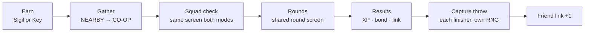
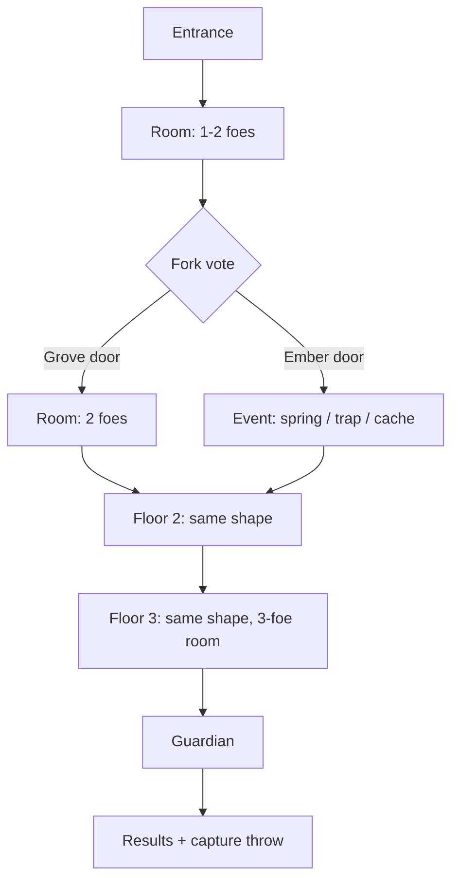
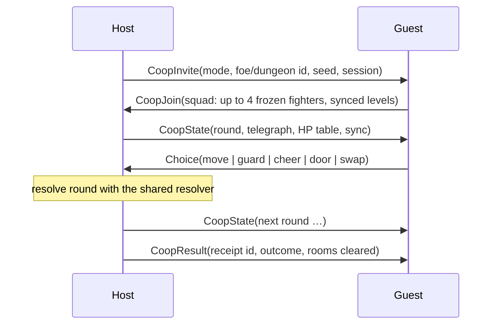

# Co-op expeditions: boss raids and dungeon raids — design (proposed, not implemented)

Status: design for review; nothing here is in the core. Builds on rules 17 ([care mistakes and injury](CARE_MISTAKES_INJURY.md)), rules 18 ([auto-battle balance and focus taps](AUTO_BALANCE.md)) and the Nearby transport ([protocol](NEARBY_PROTOCOL.md)), which is now confirmed working between two real devices. Supersedes the earlier boss-only draft. **Revision 2:** co-op is capped at **two players**; Partners uses a **2×2 tile grid**; BACK/LEAVE is raised and enlarged.

## Goal

Two cooperative modes that kids play **together, device to device**, that genuinely challenge the players and their Digimon, and that reward cooperation itself. Both modes run on **one session system, one round resolver and one set of screens**, so learning one teaches the other.

| | **Boss raid** | **Dungeon raid** |
| --- | --- | --- |
| Fantasy | A giant rare Digimon appears; friends gather to take it down | A short expedition through themed floors with a guardian at the end |
| Earned by | **Walking**: a **Boss Sigil** every 5,000 eligible steps | **Battling**: a **Dungeon Key** every 8 wild victories |
| Players | 1–2 devices (solo allowed, tuned for 2) | **Exactly 2 devices** (co-op only) |
| Who must hold the item | Host only | Host only |
| Each player brings | Active partner | **Squad**: active partner + up to 3 squad members (today's XP companion slots) |
| Length | 3–5 minutes | 8–12 minutes (3 floors) |
| Where the challenge comes from | One huge foe, telegraphed attacks, phases | Attrition: HP carries between rooms, no Rest inside, knocked-out Digimon are benched |
| Headline reward | One guaranteed capture throw at the boss **per finisher** | One guaranteed capture throw at the guardian per finisher, plus squad-wide XP and bond |

One held item of each kind at a time; neither expires (overnight/off time is never punished). Holding them never blocks ordinary walking encounters.

## The shared co-op pattern

Every co-op activity — and the existing duel and trade — follows the same five steps, the same screen layouts and the same button rules.

**UI rules, applied everywhere (existing device patterns, no new widgets):**

| Rule | Existing precedent |
| --- | --- |
| One screen title badge under DIGIVICE, mint | every screen |
| One centered hero sprite, name badge above, one status badge below | Collection, Nearby, Starter |
| Left/right chevrons + swipe browse; never more than one carousel per screen | Collection, Nearby peers |
| At most **one primary** (large, center) and **two secondary** buttons, plus BACK/LEAVE | Stats, NearbyReview, Evolution |
| Lists of Digimon are a **2×2 tile grid** (128×96 tiles, 8 px gaps), never a long carousel | Partners rework |
| One **focus tap** per fight uses the same timing ring as capture (STRIKE!/BLOCK!) | Rules 18 Auto focus |
| Choices are the existing **3-option icon carousel** (attack *or* guard set) | Tactical battle, Nearby duel |
| Anything that saves or costs shows a review screen first; review text in amber | ModeReview, ReleaseReview, Trade |
| Status words, not just color: HURT, READY, LINK, COVER, CHEER | capture grade words |
| Every screen has BACK/LEAVE in the same spot: **200×52 at x 106–306, y 292–344**, hit area padded 12 px, release anywhere inside the padded box counts | Replaces the old 124×38 at y=348, which sat in the bezel curve |

## Entry points

There is **no new top-level menu**. Home stays at four panels (CARE, PARTNERS, SETTINGS, NEARBY).

- **Home**: the NEARBY panel's subtitle shows what you hold (`SIGIL READY · KEY 5/8`). A small pip on the NEARBY dot means something co-op is ready.
- **NEARBY**: the peer screen gains the existing two-option toggle pattern at the top: **VS** (duel, trade — today's screen) | **CO-OP**.
- **CO-OP tab**: if you hold a Sigil or Key, the primary button is **HOST BOSS** / **HOST DUNGEON** (carousel if you hold both). If a nearby device is hosting, its card shows the host's partner, the mode and `1/2 JOINED`, and the primary button is **JOIN**.
- **PARTNERS** is where you prepare: the reworked Squad screen (below) shows HP, injuries and readiness for the squad you'll bring.

## One round resolver for both modes

A **round** is the unit of play in boss rooms, dungeon rooms and the guardian alike.

1. **Telegraph.** The foe announces `{Physical | Magic | Heavy} → one player | ALL`, one round ahead, from a role-weighted table on a seeded stream separate from capture RNG.
2. **Choose (simultaneous).** The targeted player's carousel shows **guards** (Brace / Ward / Counter); the other player's shows **attacks** (Physical / Heavy / Magic). A player whose fighter is down shows a single **CHEER** button.
3. **Resolve** in a fixed order: guards → player attacks (slot order) → foe attack. Damage uses the existing `resolveCareForms`, type chart, guard halving, Counter reflection, 5% crit, Practice chip floor `ceil(maxHp/20)` for player hits, Heavy costs 6 energy.
4. **Idle**: 30 s without a choice → that player's choice comes from the native Auto policy. Nobody stalls the pair.
5. **Focus**: once per foe, the targeted player gets the rules-18 ring prompt (BLOCK! on a guard round, STRIKE! on an attack round). Same timing, grades and 2× / 1.5× / 0 scaling as wild Auto, so a skill learned on walks pays off in raids.

### Cooperation mechanics (the bonding part)

| Mechanic | Trigger | Effect |
| --- | --- | --- |
| **Perfect guard** | Targeted player picks the guard that matches the telegraph (Brace↔Physical, Ward↔Magic, Counter↔Heavy) | Damage quartered instead of halved; +10 Sync |
| **Link attack** | Both players pick the same attack category in a round | +25% damage on each linked hit; +10 Sync |
| **Cheer** | A player whose fighter is down taps CHEER | +5 Sync; nobody is ever sitting out |
| **Sync meter** | Shared team meter 0–100, shown as an arc around the foe HP bar | At 100 the next round is **TEAM UP**: every attack ×1.5, every guard perfect, then reset |

Sync makes the best play a *coordinated* play, and it has to be talked about out loud — that is the bonding.

### Difficulty is budgeted in hits, not multiplied

Foe HP = `H × bestHit(pair average fighter → foe)`, clamped to [1×, 6×] the form's natural max HP. This stays fair at every level, independent of the damage-vs-level problem in the balance review.

| Foe | Solo | Pair |
| --- | --- | --- |
| Boss | 12 | 21 |
| Dungeon room foe (1–3 per room, fought one after another) | — | 7 |
| Dungeon guardian | — | 17 |

Foes are one combat tier above the host's partner (Mega faces Mega), at host partner level +3. **Level sync**: every fighter fights at `min(own level, foe level + 5)`, never below its form's `minLevel`; rewards use real levels.

Target outcomes, to be locked with the native balance harness (the rules-18 `auto-balance-sim` extended to rounds) before shipping: boss pair win ≈ 70%, solo ≈ 45%; dungeon full clear ≈ 50% on first attempt, ≈ 75% with a prepared, type-matched squad. With only two players every round, both devices are always deciding something — no passengers.

## Boss raid specifics

- **Phases**: ≤66% HP the boss telegraphs Heavy twice as often; ≤33% it adds an **ALL** attack every third round (everyone guards that round — the most cooperative moment in the fight).
- **Loss**: knocked-out partners are injured; the boss stays held. **Flee** after 40 rounds: no injury; boss stays held.
- **Rewards**: 3× wild XP (`3 × (20 + 6 × bossLevel)`) to partner and squad, +20 bond, then **one capture throw per finisher** at base 60%, graded by the existing timing ring.

## Dungeon raid specifics

- **Theme**: the key's dungeon is themed by type (grove/tide/ember, cycling), so a counter-type squad is a real preparation choice.
- **Fork vote**: each floor ends at two doors (type-themed). Both devices tap a door; if you agree it opens at once, if not both see the other's pick for 5 s and may switch, then the host's pick wins. Small decision, made together.
- **Events**: *spring* heals every active fighter 30%; *trap* telegraphs an ALL attack the team must guard; *cache* gives each player a one-use Spark or Shelter card for the next room.
- **Entry**: a squad member that is already injured cannot enter; the lobby marks it HURT and benches it for the run (treat at Home first).
- **Attrition**: HP and energy persist between rooms; **no Rest inside**. Between rooms each player may swap their active fighter for a squad member (squad check screen, 20 s). A knocked-out fighter is injured and benched for the rest of the run.
- **Wipe**: if every player's active fighter is down at once, the run ends. Rooms cleared still pay XP; the key is spent (it is the run's entry ticket; its cost is 8 wins, not walking).
- **Rewards**: per room, wild XP to each fighter that took part; on clear, +30 bond to every squad member that fought, and **one capture throw per finisher** at the guardian (rare form).

## Rules that protect the "bonding" intent

- **Co-op knockouts injure but do not count a care mistake.** Helping friends must never lock a child out of their clean Digivolution route. Neglecting the injury afterwards still counts (rules 17).
- **Every finisher gets the full reward and their own throw.** No loot contention.
- **Guests never pay.** Only the host spends a Sigil or Key, and every guest is a future host.
- **Friend links.** Each device remembers the last 8 co-op friends (device ID + count). Link count shows on results (`LINK 4 WITH 00AB`). Future hook: Jogress (DNA Digivolution) routes that need a friend link — the fusion work deferred in the backlog.

## Networking

Same transport as duels: ESP-NOW channel 1, host-authoritative lockstep, 500 ms retry, 5 s reconnect, 30 s drop, CRC32, MAC + nonce + session checks, one unacknowledged exchange at a time.

Fighters are sent **once** at join; state packets carry only HP and status, which keeps both modes in one format:

| Packet | Layout | Size |
| --- | --- | --- |
| CoopJoin | header 34 + squad count 1 + flags 1 + 4 × 20 fighters + CRC 4 | **120 B** |
| CoopState | header 34 + encounter 24 (foe, HP, phase, telegraph, round, floor/room) + 2 players × 11 (active slot, energy, 4 × u16 HP, status) + team 4 (sync, vote) + CRC 4 | **88 B** |
| Limit | | 240 B |

Two devices is exactly what duels already prove on hardware, so there is no new multi-peer risk. Dropouts: a guest's fighter goes Auto for the rest of the session and the guest gets no reward (no result received). Host drop ends the session; the Sigil/Key is not spent; guests lose nothing.

**Rewards from radio** follow the trade pattern: the host's CoopResult is a receipt (session, mode, foe, participants, seed, outcome, rooms). Each device journals it in NVS, then applies one durable `coop-reward(slot)` event whose parameters replay from the journal; a claim ring of the last 8 session IDs blocks duplicates; the service accepts it only with the archived receipt. Friendly-play trust, not anti-cheat — same scope as duels.

## Save cost (schema 25)

| Field | Bytes |
| --- | --- |
| Boss charge steps + held boss {form, level, index} | 16 |
| Dungeon key progress + held key {theme, index} | 8 |
| Co-op claim ring (8 session IDs) | 32 |
| Friend links (8 × device ID + count) | 64 |
| Boss / dungeon clears | 4 |
| **Total** | **124** (3,216 → 3,340) |

## Partners screen rework

Co-op makes the squad matter, so Partners becomes **squad-first** instead of a 60-item one-at-a-time carousel. "XP companions" are renamed **Squad** (same three slots, same XP sharing) because they are now also your dungeon bench. A mock of the reworked Partners screens and the shared co-op screens (Squad, Box, Member, Nearby CO-OP tab, Lobby, round screen, fork vote, results) lives on a design canvas linked from the PR.

| Today | Problem | Rework |
| --- | --- | --- |
| Collection opens on one Digimon; 60 swipes to see everyone | No overview; the roster is invisible | **SQUAD** landing: a **2×2 grid** — partner top-left, 3 squad tiles — each 128×96 with sprite, LV, HP bar and status word (HURT, READY). The whole tile is the tap target |
| Companion toggle is a separate button above two others | Four actions, unclear priority | **One contextual primary** per member: TREAT › MAKE PARTNER › ADD TO SQUAD / REMOVE; everything else under DETAILS |
| Status split across 4 stats pages | Injury, mistakes, evolve-readiness not visible while choosing | **MEMBER** card shows HP bar, bond (4 hearts = bond/50), care mistakes vs. route limit, injury word |
| No sorting | Finding a hurt or ready Digimon is a hunt | **BOX** 2×2 grid pages (15 pages for 60), page dots + swipe, sort chip cycles NEW · LV · READY · HURT |
| OWNED ID on every screen | Developer detail in a kid's UI | Moved to DETAILS |
| BACK is 124×38 low on the round edge | Users miss it; its lower corners are outside the touch circle | Raised, 200×52 BACK in the shared spot (see UI rules) |

Why 2×2: the 412 px round panel is about 37 mm across, roughly 11 px/mm. A 128×96 tile is ≈ 11.5 × 8.6 mm — comfortably above the ~9 mm thumb target — and the grid (264×200 at left 74, top 80) sits entirely inside the circle, clear of the bezel curve. A 3×3 grid would need ≈ 80 px (7 mm) tiles.

The co-op **Squad check** reuses the SQUAD layout with readiness words, so preparing at home and checking in the lobby are the same screen.

## Build order

| Phase | Scope | Depends on |
| --- | --- | --- |
| 1 | Partners rework (Squad / Box / Member); Sigil + Key earning; schema 25 fields | rules 17 |
| 2 | Shared round resolver + Sync mechanics, host-tested with portable fault injection; boss raid end to end | Phase 1 |
| 3 | Dungeon raid: floors, fork vote, events, swaps, guardian | Phase 2 |
| 4 | Receipts, `coop-reward`, claim ring, friend links, service archive | Phase 2 |
| 5 | Balance pass over all forms × tiers × party sizes; lock H values | Phases 2–3 |

## Risks

1. **Damage scaling with level** is fixed for wild play by rules 18; raids still budget foe HP in hits, so they stay independent of it.
2. **Two-device cap** keeps sessions within what duels already prove; three or more is out of scope.
3. **Dungeon length vs. attention**: 8–12 minutes is long for younger kids. The 30 s Auto fallback and CHEER keep everyone in; if playtests show drop-off, cut to 2 floors.
4. **Browser simulator** has no radio; co-op is device-only unless a host-side multi-session simulator is added for testing.
