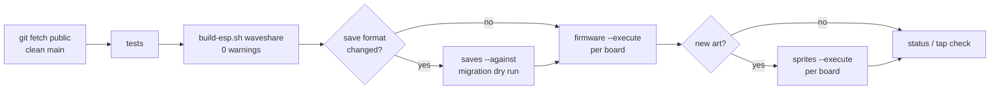

# Deploying to the Digivices

How to put the current game on the physical boards (Waveshare ESP32-S3-Touch-LCD-1.46, SKU 29565) without touching anyone's save. One tool does the device work: [`scripts/deploy-device.py`](../scripts/deploy-device.py). Every write needs `--execute`; without it each command is a dry run.

A deploy has two independent parts:

| Part | Where it goes | What stays untouched |
| --- | --- | --- |
| **Firmware** | Application image only, at `0x20000` (the `ota_0` slot) | Saves and settings in NVS (`0x9000`), bootloader, partition table, OTA data, SD card |
| **Sprites** | `DSFnnnnn.DVA` files in each board's microSD root, sent over USB | Firmware, saves, every other file on the card |



## One-time setup

The toolchains live next to the repository in `../.toolchains` (override with `DIGIVICE_TOOLCHAINS`):

| Folder | Used for |
| --- | --- |
| `esp-idf-v5.3.6`, `espressif-v5.3.6` | Official ESP-IDF 5.3.6 build, with the Python env `python_env/idf5.3_py3.9_env` |
| `esptool-venv` | `esptool` and `pyserial`. `deploy-device.py` re-runs itself in this environment when `pyserial` is missing |

Build the host core once (and after every pull). The deploy tool uses `build/digivice-core` to read saves:

```bash
cmake -S . -B build -DCMAKE_BUILD_TYPE=Release && cmake --build build -j 4
```

Backups are written to `../device-backups` (override with `DIGIVICE_BACKUPS`). The tool refuses a backup folder inside the repository. Backups, MACs, boot logs and sprite packs are private: never commit them.

## 1. Find the boards

```bash
python3 scripts/deploy-device.py boards
```

This lists each board's MAC and port from USB enumeration only: no reset and no serial commands. Ports change between cable reconnects, so every other command takes `--mac`, never a port. If a board is missing, check that the USB-C cable carries data and that the board is powered, then run `boards` again.

## 2. Start from the published source

`public` is GitHub (`goldsziggy/z-ark-digivice`). `origin` is an old local mirror, so do not deploy from it.

```bash
git fetch public && git switch main && git merge --ff-only public/main
```

The working tree must be clean. A dirty build reports `project_version` ending in `-dirty`, and the tool refuses it.

## 3. Test

```bash
npm run test:publication
```

```bash
bash firmware/tests/run.sh
```

```bash
TAP_AUDIT_REPORT=1 ./build/device-ui-test
```

`npm run test:publication` builds the host and runs the published test scope. Only `background-decode-test` may be missing, because the private scenery is not in the repository. The tap audit prints every screen's targets: all must stay inside the touch circle, ≥ 36 px per side, ≥ 6 px apart.

## 4. Build the firmware

```bash
DIGIVICE_IDF_PYTHON_ENV="$PWD/../.toolchains/espressif-v5.3.6/python_env/idf5.3_py3.9_env" bash scripts/build-esp.sh waveshare
```

The wrapper's default Python env (`py3.13`) does not exist on this machine, hence the variable. Expect **0 compiler warnings**. The output is `firmware/build-waveshare/digivice.bin`. Note the image size against the 3 MiB slot. IRAM is effectively full (16,383 of 16,384 bytes), so new `IRAM_ATTR` code will not link.

## 5. If the save format changed, dry-run the migration

A schema/rules bump (`kSchemaVersion` / `kRulesVersion` in `core/game.hpp`) migrates each board's save the first time the new firmware checkpoints. That is one-way, so prove it on host first. The last deploy left each board's NVS image and its decoded summary in its backup folder. Decode the same bytes with the **new** host CLI and compare:

```bash
python3 scripts/deploy-device.py saves --nvs ../device-backups/<last-deploy>/<mac>/nvs-after-boot.bin --against ../device-backups/<last-deploy>/<mac>/save-after.json
```

It exits non-zero if anything other than `schema`/`rules` differs. Any difference is a migration bug. Stop and fix it in core before flashing. (`--against` expects a summary written by this tool; older hand-made backup folders use a different layout.)

The firmware command also decodes each board's current save with the new CLI **before** writing. If the new code cannot read a save, it stops without flashing.

## 6. Deploy the firmware

Dry run first. It checks the image and that every board is connected, and reads nothing from the boards:

```bash
python3 scripts/deploy-device.py firmware --mac <mac-1> --mac <mac-2>
```

Then deploy:

```bash
python3 scripts/deploy-device.py firmware --mac <mac-1> --mac <mac-2> --execute
```

For each board, in order, the tool:

1. Backs up NVS (`0x9000`, 64 KiB) and decodes the save to `save-before.json`.
2. Reads the board's partition table and **stops if it differs from the build's**. An app-only update is only valid on the same layout.
3. Backs up the installed app slot; if it already matches the new image, it skips the write.
4. Writes the app **only** at `0x20000`, reads it back and compares the bytes. On a mismatch it stops before booting.
5. Hard-resets into the app, captures the boot log, and requires the `digivice>` prompt, `App version: <sha>`, and no recovery mode. It reports the `SD asset cache boot` line.
6. Reads NVS again, decodes `save-after.json`, and stops if anything beyond schema/rules/sequence changed.
7. Leaves the board running and writes `deploy.json`.

Each board's evidence lands in `../device-backups/<date>-<sha>/<mac>/`: `nvs-before-flash.bin`, `partition-table.bin`, `app-before.bin`, `app-readback.bin`, `boot.log`, `nvs-after-boot.bin`, `save-before.json`, `save-after.json`, `deploy.json`.

After a schema bump, the boot log says `older snapshot migrated in RAM; original retained until next checkpoint`. NVS keeps the old bytes until the first game action saves. Until then, the backup and a downgrade still match.

## 7. Push sprites (new forms or new art)

Sprites are private and gitignored. The Dawn/Dusk sheet sprites are generated into `.personal-assets/world-ds/sheet-sd` by `scripts/pack-dawn-dusk-sheets.py --write`. That folder also holds stale files from earlier runs (forms 12–275 and 466–485), so **always pass `--forms`** with the range the roster plan added.

Inspect first. This is read-only: it checks the identity and the hash of every destination file:

```bash
python3 scripts/deploy-device.py sprites --mac <mac> --dir .personal-assets/world-ds/sheet-sd --forms 277-465
```

Then install:

```bash
python3 scripts/deploy-device.py sprites --mac <mac> --dir .personal-assets/world-ds/sheet-sd --forms 277-465 --execute
```

Before sending, every file is checked against the firmware's own DVA rules (header, frame table, CRC). Files already on the card with the same hash are skipped. A file with the same name but **different bytes** is a `CONFLICT`: the transfer stops before writing anything. Each new file is read back, and a final pass verifies every hash. Throughput is about 4–6 KB/s, so 189 sprites (3.1 MB) take roughly 9 minutes per board. Boards are independent, so run both at once on their own ports. Reports go to `../device-backups/<date>-sprites/<mac>/`.

The protocol is described in [USB_SD_TRANSFER.md](USB_SD_TRANSFER.md). The UI pauses during a transfer and resumes when the tool releases its lease.

## 8. Check the boards

```bash
python3 scripts/deploy-device.py status --mac <mac>
```

This prints the board's read-only `device status`: screen, artwork, steps, touch counters, audio, IMU and heap. For a touch check, watch the counters while someone taps the screen:

```bash
python3 scripts/deploy-device.py status --mac <mac> --watch 60
```

`presses` and `releases` should rise with each tap. If `samples` keeps rising while `presses` stays at 0 through deliberate taps, the touch controller is not reporting contacts. That is a hardware or controller-level fault, not a deploy problem. Record it, and do not work around it in software.

## 9. Record a release

When a build is published as a release, add a `releases/firmware-<sha>/` folder in the pattern of [6a3bd5c](../releases/firmware-6a3bd5c/README.md): images, `manifest.json` with hashes and sizes, and a sanitized `installation-summary.json`. Then update the README "Current source" and [PUBLICATION_VALIDATION.json](../PUBLICATION_VALIDATION.json). Sanitized means no MACs, saves, boot logs or private art.

## Never

- Erase flash, or write the bootloader, partition table, OTA data or NVS.
- Copy one board's NVS or SD contents to the other. Each board keeps its own save and identity.
- Flash firmware older than a board's save schema to "start fresh". Older firmware stops in read-only recovery.
- Format, repartition or "repair" an SD card. `SD_UNAVAILABLE` needs diagnosis.
- Use `scripts/flash-device.py`. It is pinned to the historical `6e058e1` package and refuses current builds.

## Troubleshooting

| Message | Meaning and next step |
| --- | --- |
| `board … is not connected` | Not enumerated. Reseat the data cable; run `boards`. A `Resource busy` error means another serial monitor (or another agent) has the port. Close it first. |
| `partition table differs from this build` | The layout changed. An app-only update is not valid. Stop and review the partition change. |
| `host CLI could not decode the save` | The save is newer than this build, or corrupt. Do not flash older firmware. Build the matching source, or investigate the backup. |
| `application readback does not match` | The write did not land intact. The board was not booted. Check the cable and run the same command again. |
| `did not reach the app prompt` | Read `boot.log` in the backup folder. Do not reflash in a loop. See [USB_BOOT_RELIABILITY.md](USB_BOOT_RELIABILITY.md). |
| `save changed beyond schema/rules/sequence` | Something rewrote the save during boot. The backups have both images. Compare `save-before.json` and `save-after.json` before going further. |
| `sprites … CONFLICT` | The card already has a different file under that name. Find out where it came from before replacing anything. |
| `device refused with IO` | The card returned a filesystem error. One board saw this once and cleared after a reboot. Run `status`, then inspect again before `--execute`. |
