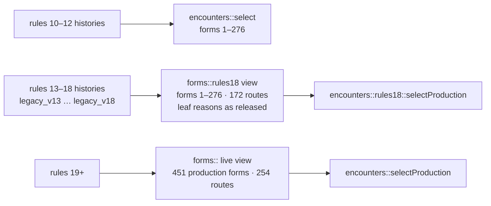

# Rules 19: the 465-form roster

Rules 19 / schema 26 opens the Champion-and-up Dawn/Dusk additions (IDs 277–465, commit `c744aed`) to wild encounters. Earlier rules keep the 276-form roster exactly as released, so every existing history replays unchanged.

## Why a rules bump

`c744aed` added 189 forms without a rules version. Wild encounters under rules 13–18 (and the frozen rules 10–12 pool) pick by seeded index from the live roster, so the same history met a different Digimon:

| Partner tier | Encounters that changed (same seed, same history) |
| --- | --- |
| Rookie | 0% |
| Champion, Ultimate, Mega | 97.7–99.2% |

Thirty-four existing forms also gained routes, which changes rules-17 care locking (a form with a second route can lock route 0). The service rebuilds saves by replaying event histories, so affected players would have received a different save or a rejected history.

## What is frozen

- `core/forms_rules18_frozen.inc` is a byte copy of the rules-18 route table, leaf reasons and terminal flags from `3014594`. It is never regenerated; `static_assert`s pin 172 routes inside forms 1–276.
- `core/legacy_v18.{hpp,cpp}` freezes the rules-18 engine. It and `legacy_v13`–`legacy_v17` use the `forms::rules18` / `encounters::rules18` views.
- Form records 1–276, their rarities and the 172 routes were verified unchanged by `c744aed`, so the frozen view reproduces the old roster exactly.

Verification: 48,000 encounter draws from the frozen picker are identical to `3014594`, and a differential corpus of 1,386 histories (rules-18 and rules-17 snapshots with Rookie to Mega partners, plus rules 12/13/16/17/18 seed histories) replays byte-identically between `3014594` and the new frozen executors.

## Migration

| Store | Path |
| --- | --- |
| Device snapshot schema 25 | Decodes as `Migrated` to schema 26; an encounter already in progress keeps `wildRules` 18 and its foe, the next encounter is a rules-19 draw. |
| Service store format 20 | Archived once to `store.rules-v18.json`; the history moves into `legacy.histories` (rules 18) and is restored through `--migrate-v18` / `--replay-v18-*-trace`. Store format 21 / schema 26 / rules 19. |
| Trade transcripts | Rules 18 transcripts remain valid; a rules-18 peer still rejects forms it does not know. |

## Roster corrections in rules 19

**Retired duplicates.** Four additions were the Dawn/Dusk romanization of species already on the roster. Their IDs stay reserved (the ledger is append-only and private sprite files are named by ID), but they are not production forms: never encountered, never offered in trade, not published, no routes.

| Retired ID | Name | Same species as |
| --- | --- | --- |
| 279 | Chrysalimon | 146 Kurisarimon |
| 286 | DarkTyranomon | 127 DarkTyrannomon |
| 287 | DarkLizamon | 126 DarkLizardmon |
| 288 | FlareLizamon | 132 Flarerizamon |

**Held routes.** Nine routes moved to `heldProposals` in `data/world-ds-evolutions.json` with reasons. Stage skips and same-stage mode changes need individual review, as for the earlier deferred skips:

| Route | Why held |
| --- | --- |
| Birdramon → Goddramon, Coelamon → Plesiomon, Shellmon → Plesiomon | Champion → Mega stage skip |
| Vegiemon → RedVegiemon | same-stage variant change |
| Beelzemon → BeelzebumonBlast, Rosemon → RosemonBurst | same-stage mode change |
| Keramon → Chrysalimon, Chrysalimon → Infermon, Kurisarimon → Chrysalimon | retired duplicate (Keramon → Kurisarimon → Infermon already exists) |

Every remaining live route goes up exactly one combat tier (asserted in `tests/rules19_test.cpp`).

## Balance (rules 19, `scripts/auto-balance-sim.cpp`, 120 fights per level)

| | Rules 18 (276 forms) | Rules 19 (451 live forms) |
| --- | --- | --- |
| Unattended Auto win | 91.0% | 91.4% |
| Green focus tap | 94.8% | 94.9% |
| Worst level | 87.5% | 83.3% (L27) |
| Longest fights (p90) | ≤ 12 | ≤ 12 |

New forms are 37–43% of wild encounters once the partner is Champion or above; 80% of them are `neutral` type.

## Still open (need the private sprite files)

- **Facing.** `local_form_facing.hpp` covers forms ≤ 276; 277–465 are `Unknown` and never mirrored. Audit the decoded pixels and extend the table.
- **SD index.** `prepare-world-ds-sd.py` stages only forms in the audited private `index.json`; the sheet packer writes `sheet-sd/` without index entries or provenance.
- **Idle clip.** The packer mixes full-size battle frames with unscaled walk frames in the idle clip; existing forms use battle poses only.
- **Types and names.** 151 of the 189 additions are `neutral`; several names differ from the roster's spelling (Tyranomon, Milleniumon, Orphanimon, BeelzebumonBlast).
