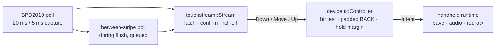

# Touch sprint: tap bugs on the Waveshare 1.46 (SPD2010)

Bugs found and fixed in the handheld touch path, measured against the device's recorded timing. Everything here is host-tested; **none of it is physical finger acceptance** (see the bench checklist at the end).

## Device facts the tests use

| Fact | Value | Source |
| --- | --- | --- |
| Panel | 412 × 412 logical, 37.1 mm active → **11.1 px/mm**, touch circle r = 204 px | `TOUCH_READINESS.md`, `device_ui.cpp` |
| Touch controller | SPD2010 on shared I²C 0x53, INT GPIO4, **polled** (vendor demo is interrupt-driven) | `display_touch.cpp` |
| Controller scan | 60–100 Hz; one report held until the host clears it | vendor handshake in `readTouch` |
| Poll cadence | 20 ms normally, 5 ms while the capture ring animates | `handheld_ui.cpp` |
| Frame cadence | full frame due 80 ms after the last when dirty, 160 ms otherwise | `handheld_ui.cpp` |
| Frame cost | unit 1: 30.0 ms render + 45.7 ms flush (76 ms); unit 2: **141 ms** | `DEVICE_READINESS.md` |
| UI tap rules | Down→Up ≥ 20 ms, ≤ 1.8 s, ≤ 24 px slop (except held-button margin) | `Controller::touch` |

What a poll reads *between* controller scans has never been measured, so the waveform harness runs every scenario under three SPD2010 models: **latched** (a report waits until cleared), **level** (a read shows only the current contact) and **chatter** (a between-scan read decodes as "running, no data" = a fresh release, even with the finger down). Fixes had to hold under all three.

## Pipeline

`firmware/runtime/touch_stream.{hpp,cpp}` is new: the per-sample logic that was inline in `HandheldRuntime::pollInterface`, now shared by the firmware and the host tests.

## Bugs fixed

| # | Bug | Effect (model) | Fix |
| --- | --- | --- | --- |
| 1 | **First tap after boot, wake or I²C error eaten.** The release latch cleared only on a fresh release report; latched/level controllers send none until a finger lifts, so that first tap only rearmed the latch | 0% of first taps under latched/level, 100% → see table | Quiet rearm: no fresh contact for 150 ms also clears the latch. A finger resting on the glass keeps it latched; a stale cached "pressed" level neither holds it nor starts a phantom Down |
| 2 | **Held finger forced full redraws.** Every held Move sample set `interfaceDirty_`, so a held finger triggered a 75–141 ms frame every 80 ms, during which touch was not polled | Short taps lost on slow frames (level: 54% of 40 ms taps on unit 2) | Moves redraw only when they cancel a press; Down, Up and intents still redraw |
| 3 | **Blind flush window.** No touch polling during the 46–111 ms flush | Same as #2 | `flushRgb565` takes an optional between-stripe hook; it reads and queues samples at the **same 20 ms cadence** (faster polling makes 40 ms taps measure under the UI's 20 ms minimum — the harness caught this), handled right after the flush, never mid-frame |
| 4 | **Chatter Up/Down.** A single not-pressed read sent Up immediately; under the chatter model, a held finger at the 5 ms capture cadence split into fragments | Fragmented holds | Up only after no pressed report for 25 ms (adds one poll of Up latency) |
| 5 | **Lift roll-off cancelled taps.** As a finger peels away its centroid slides; the last sample often moved > 24 px and cancelled the tap. The old loop's stalls hid this by skipping those samples — fixing #2/#3 exposed it | 4 mm roll-off: 84% on 139×44 buttons | Moves are held back one sample; a final sample within 30 ms of the lift is dropped as roll-off. Pressed buttons also keep an 8 px / 44 px hold margin |
| 6 | **4 px gaps** between row buttons and the new BACK spot (Starter, Partners, Stats, Evolution, reviews; 5 px tactical battle) | Neighbour mis-taps | All gaps ≥ 6 px; companion-toggle labels moved clear of the button |
| 7 | **Firmware host tests broken on main**: capture-runtime and idle-runtime doubles were missing `pollCareAndAuto`; capture/entropy tests predated "a missed Auto throw hands the fight back to Auto" and the rules-18 focus pause; walking test failed GCC `-Wmisleading-indentation` | Real `pollInterface` code was not being tested | Doubles and tests updated; all four runtime host tests now compile the production touch methods and pass |

## Results (`./build/touch-waveform-test --report`, 400 trials per cell)

Steady state (latch already cleared), unit 1 frames:

| Gesture | Latched before → after | Level before → after | Chatter before → after |
| --- | --- | --- | --- |
| BACK tap 100 ms | 100 → 100 | 100 → 100 | 100 → 100 |
| BACK tap 60 ms | 100 → 100 | **86.2 → 100** | 100 → 100 |
| Home swipe 250 ms | 100 → 100 | 99.8 → 100 | 100 → 100 |

Unit 2's 141 ms frames, quick taps on BACK:

| Tap | Latched before → after | Level before → after |
| --- | --- | --- |
| 40 ms | 100 → 100 | **54.0 → 91.5** |
| 60 ms | 100 → 100 | **57.8 → 97.8** |
| 80 ms | 100 → 100 | **72.2 → 100** |

First tap after boot, motion wake or one I²C error: **0 → 100%** under latched and level; 100 → 100 under chatter.

Lift roll-off, 100 ms tap: 4 mm drift on a 139×44 row button **84.0 → 100%**; BACK 95.2 → 100%.

Aim scatter (Gaussian σ around the centre, fixed loop) — the limit is now geometry, not timing:

| σ | BACK 180×48 + pad | 139×44 / 212×44 buttons |
| --- | --- | --- |
| 1.0 mm | 99.8% | 96.5% |
| 1.5 mm | 97.0% | 84.2% |
| 2.0 mm | 89.5% | 69.0% |

The 139- and 212-wide buttons score the same: **44 px (4.0 mm) height is the limiting dimension.** Taller targets, such as the 2×2 Partners tiles (92–96 px), are the next accuracy gain; that is a layout redesign, not part of this sprint.

## Tap-target audit (`device_ui_test`, `TAP_AUDIT_REPORT=1`)

20 screens, 56 targets. Every target: inside the touch circle with a 4 px bezel margin, ≥ 36 px (3.2 mm) on each side, no overlaps, ≥ 6 px (0.5 mm) to its neighbour, its centre tap does something, disabled targets stay inert, and a tap never writes State by itself.

| Screen | Targets | Smallest | Closest gap |
| --- | --- | --- | --- |
| Egg | 2 | SETUP 38 px (3.4 mm) | 18 px |
| Starter / Hatch review | 2 / 2 | 44 px (4.0 mm) | 6 / 28 px |
| Home (4 panels) | 3 | 46 px (4.1 mm) | 54 px |
| Care, Settings, Encounter settings | 5 / 7 / 5 | 44 px | 6 px |
| Partners | 4 | ACTIVE PARTNER 36 px (3.2 mm) | 6 px |
| Stats, Evolution, Sound, Mode review | 2 / 3 / 3 / 2 | 44 px | 6–20 px |
| Encounter, Battle, Capture, Result, Nearby | 1–3 | 44–52 px | 6 px |

Not yet audited: release/evolution reviews, trade and live Nearby duel screens (need radio/trade fixtures).

## Bench checklist (physical acceptance still pending)

1. Serial `device touch` line now prints `presses releases chatter rearms rolledOff`. After 5 minutes of normal play report all five. **`chatter` > 0 means the controller really does chatter** (model 3) — the fix is already in; the number tells us which SPD2010 model is real. `rearms` > 0 means release reports are missed after wakes.
2. Wake the screen by motion, then tap BACK once: it should act on the first tap.
3. Tap BACK quickly (flick-tap) 20 times on Settings: count misses.
4. Rest a finger on the glass while waking: nothing should activate until it lifts.
5. Roll a fingertip off MODE (row button) as you lift: it should still open the review.
6. Hold a finger on the capture ring for 2 s: exactly one throw/answer.
7. Tactical battle: a short, fast swipe-up (about 5 mm) should still commit the move. The roll-off filter can trim the final ≤ 20 ms of a swipe; the 40 px swipe threshold has margin for normal swipes, but a very short flick is the case most likely to need a smaller threshold.

## Files

`firmware/runtime/touch_stream.*` (new), `firmware/main/handheld_ui.cpp` (pipeline wiring, flush hook, counters), `firmware/main/display_touch.*` (between-stripe hook), `firmware/runtime/device_ui.*` (hold margin, 6 px gaps, `layout()` for audits), `tests/touch_waveform_test.cpp` (harness + gates, CMake `touch-waveform-test`), `tests/device_ui_test.cpp` (`tapAudit`), firmware host test doubles.
